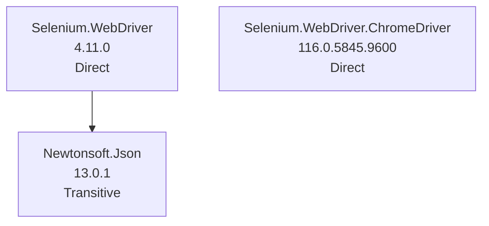

# NuGet Audit Report - WebLogin

- Snapshot ID: `20260405130422_3bb05985`
- Captured UTC: `2026-04-05T13:04:22.9651152+00:00`
- Solution: `C:\Users\windo\OneDrive\Documents\Development\WebLogin\WebLogin.sln`
- Source identity key: `62F6257140094879`
- Source identity kind: `disk-path`
- Source machine: `SURFACELAPTOP7`
- Repository root: `C:\Users\windo\OneDrive\Documents\Development\WebLogin`
- Git remote: `-`
- Analysis status: `Complete`
- Projects analysed: `1`
- Packages discovered: `3`
- Direct packages: `2`
- Transitive packages: `1`
- Dependency edges: `1`
- Error diagnostics: `0`
- Warning diagnostics: `2`
- Delta changed: `True`
- Knowledge snapshot generated: `2026-04-05T13:04:22.9651152+00:00`

## Attention Required

| Severity | Project | Package | Message | .NET version |
|---|---|---|---|---|
| Warning | WebLogin | Newtonsoft.Json | Package 'Newtonsoft.Json' 13.0.1 is outdated. Latest compatible stable version: 13.0.4. | net6.0 |
| Warning | WebLogin | Selenium.WebDriver | Package 'Selenium.WebDriver' 4.11.0 is outdated. Latest compatible stable version: 4.41.0. | net6.0 |

## Change Summary

| Project | Package | Change | Previous | Current | .NET version |
|---|---|---|---|---|---|
| WebLogin | Selenium.WebDriver.ChromeDriver | MetadataChanged | 116.0.5845.9600 | 116.0.5845.9600 | net6.0 |

## Knowledge Changes

| Package | Version | Determined UTC | Previous Health | Current Health | Risk | Alert | Remediation | Summary |
|---|---|---|---|---|---|---|---|---|
| Selenium.WebDriver.ChromeDriver | 116.0.5845.9600 | 2026-04-05T13:04:22.9651152+00:00 | abandoned | ok | 28.10 (Medium) | 35.00 (Medium) | - | Development status is now Active. Remediation guidance changed. |

## Security and Health Transitions

| Project | Package | Previous Health | Current Health | Previous Vulnerabilities | Current Vulnerabilities | .NET version |
|---|---|---|---|---|---|---|
| WebLogin | Selenium.WebDriver.ChromeDriver | abandoned | ok | - | - | net6.0 |

## Dependency Relationship Changes

No dependency edge changes were detected relative to the previous accepted snapshot.

## Project Details

### WebLogin

- Path: `C:\Users\windo\OneDrive\Documents\Development\WebLogin\WebLogin\WebLogin.csproj`
- Style: `PackageReference`
- Load state: `Loaded`
- Analysis status: `Complete`
- .NET version: `net6.0`
- Diagnostics:
  - [Warning] Package 'Newtonsoft.Json' 13.0.1 is outdated. Latest compatible stable version: 13.0.4.
  - [Warning] Package 'Selenium.WebDriver' 4.11.0 is outdated. Latest compatible stable version: 4.41.0.

| Package | Kind | Requested | Resolved | Health | Vulnerability Detail | Risk | Alert | Knowledge Determined | Status Changed | Remediation | Central | Parents | Path | .NET version |
|---|---|---|---|---|---|---|---|---|---|---|---|---|---|---|
| Newtonsoft.Json | Transitive | - | 13.0.1 | outdated->13.0.4 | - | 29.10 (Medium) | 40.20 (Medium) | 2026-04-05T13:04:22.9651152+00:00 | 2026-04-05T04:21:42.7712491+00:00 | Upgrade to 13.0.4. | No | Selenium.WebDriver | Newtonsoft.Json -> Selenium.WebDriver | net6.0 |
| Selenium.WebDriver | Direct | 4.11.0 | 4.11.0 | outdated->4.41.0 | - | 32.30 (Medium) | 43.40 (Medium) | 2026-04-05T13:04:22.9651152+00:00 | 2026-04-05T04:21:42.7712491+00:00 | Upgrade to 4.41.0. | No | - | Selenium.WebDriver | net6.0 |
| Selenium.WebDriver.ChromeDriver | Direct | 116.0.5845.9600 | 116.0.5845.9600 | ok | - | 28.10 (Medium) | 35.00 (Medium) | 2026-04-05T13:04:22.9651152+00:00 | 2026-04-05T13:04:22.9651152+00:00 | - | No | - | Selenium.WebDriver.ChromeDriver | net6.0 |

#### Dependency Graph Table

| From Package | To Package | .NET version |
|---|---|---|
| Selenium.WebDriver | Newtonsoft.Json | net6.0 |

#### Dependency Graph Mermaid

## Snapshot Warnings

- Attention required: 2 package diagnostics are warnings.
